# 🚀 Storemystuff

A full-stack cloud storage application that allows users to upload, manage, and share their files securely.  
Built with **React + Vite + TailwindCSS (Client)** and **Node.js + Express + MongoDB + Redis (Server)** with **AWS S3** cloud storage and **Google Drive Import** functionality.

---

## 📚 Table of Contents

- [✨ Features](#-features)
  - [🔐 Authentication & Security](#-authentication--security)
  - [📂 File Management](#-file-management)
  - [☁️ Cloud Storage & Import](#️-cloud-storage--import)
  - [🏷️ Sharing & Permissions](#️-sharing--permissions)
  - [⚙️ Settings & Customization](#️-settings--customization)
  - [🛠️ Admin Dashboard](#️-admin-dashboard)
- [🏗️ Project Structure](#️-project-structure)
  - [Client (Frontend - React + Vite + Tailwind)](#client-frontend---react--vite--tailwind)
  - [Server (Backend - Node + Express + MongoDB)](#server-backend---node--express--mongodb)
- [📸 Screenshot Overview](#-screenshot-overview)
  - [🔐 Login & Register](#-login--register)
  - [🏠 HomePage](#-homepage)
  - [⚙️ Settings](#️-settings)
  - [📤 Share](#-share)
- [⚡ Tech Stack](#-tech-stack)
- [🚀 Getting Started](#-getting-started)
  - [Clone Repository](#clone-repository)
- [⚙️ Environment Setup](#️-environment-setup)
  - [Client `.env`](#client-env)
  - [Server `.env`](#server-env)
- [🖥️ Client Setup](#️-client-setup)
- [⚙️ Server Setup](#️-server-setup)

---

## ✨ Features

### 🔐 Authentication & Security

- User registration and login with email + password.
- OAuth Login for **Google & GitHub**.
- OTP-based verification for secure account setup.
- Passwords stored in hashed format (bcrypt).
- Token stored in cookies (Signed Cookies).
- CORS, Helmet, and sanitization for enhanced security.
- Rate Limiting & Throttling.

### 📂 File Management

- Upload any file (PDF, Images, Videos, Docs, etc.) with progress tracking.
- **Cloud storage with AWS S3** for scalable and reliable file storage.
- Supports **Grid and List views** for file navigation.
- View file details (size, type, created date, modified date).
- Search & filter files easily.
- Rename, delete (soft & hard delete), and recover files.
- Storage usage tracking with cloud-based quota management.

### ☁️ Cloud Storage & Import

- **AWS S3 Integration** for secure cloud file storage.
- **CloudFront CDN** for fast file delivery and optimized performance.
- **Google Drive Import** - seamlessly import files from Google Drive to your storage.
- Batch import functionality for multiple files.
- Progress tracking for import operations.
- Automatic file type detection and metadata preservation.

### 🏷️ Sharing & Permissions

- Share files via email **(Registered Users Only)**, or direct link **(Guest Users)**.
- Role-based sharing (Viewer / Editor ).
- Dashboard to manage **"Shared by Me"** and **"Shared with Me"** files.
- View recent activity logs (shares).
- Real-time permission updates.

### ⚙️ Settings & Customization

- Update profile info (name, email, profile picture).
- Statistic of used/available Storage.
- Change password.
- Manage connected devices/sessions.
- Account Options **(Logout/Disable/Delete)**.

### 🛠️ Admin Dashboard

- User Overview – Track total, active, online, and deleted users.
- User Management – View, filter, edit roles, force logout, and delete users.
- Deletion System – Soft Delete (recoverable) & Hard Delete (permanent) with confirmation.
- Role & Permissions – Roles like User, Manager, Admin, SuperAdmin with badges.
- File Management – Access directories/files with navigation.
- Real-Time Tracking – Monitor online users and refresh instantly.

## 🏗️ Project Structure

### Client (Frontend - React + Vite + Tailwind)

```bash
├── Client
│   ├── .gitignore
│   ├── eslint.config.js
│   ├── index.html
│   ├── package-lock.json
│   ├── package.json
│   ├── src
│   │   ├── Apis                   # Axios service layer (auth, files, share, upload, admin)
│   │   │   ├── adminApi.js
│   │   │   ├── authApi.js
│   │   │   ├── axios.js
│   │   │   ├── file_Dir_Api.js
│   │   │   ├── shareApi.js
│   │   │   ├── uploadApi.js
│   │   │   └── userApi.js
│   │   ├── App.jsx                # Root component
│   │   ├── Contexts               # App-level state and modals
│   │   │   ├── AuthContext.jsx
│   │   │   ├── ModalContainer.jsx
│   │   │   ├── ModalContext.jsx
│   │   │   ├── ProgressContext.jsx
│   │   │   └── StorageContext.jsx
│   │   ├── Pages
│   │   │   ├── AdminUserView      # Single user view (admin)
│   │   │   │   ├── Breadcrumb.jsx
│   │   │   │   ├── ItemCard.jsx
│   │   │   │   └── index.jsx
│   │   │   ├── AdminViewPage      # Admin dashboard (roles/users)
│   │   │   │   ├── DeleteModal.jsx
│   │   │   │   ├── EmptyState.jsx
│   │   │   │   ├── ErrorDisplay.jsx
│   │   │   │   ├── LoadingSpinner.jsx
│   │   │   │   ├── RoleBadge.jsx
│   │   │   │   ├── RoleChangeDropdown.jsx
│   │   │   │   ├── Sections
│   │   │   │   │   ├── Statistics.jsx
│   │   │   │   │   └── UserTable.jsx
│   │   │   │   ├── StatusBadge.jsx
│   │   │   │   ├── UserActions.jsx
│   │   │   │   ├── UserProfile.jsx
│   │   │   │   ├── UserTableRow.jsx
│   │   │   │   └── index.jsx
│   │   │   ├── DirectoryPage      # File browser (grid/list)
│   │   │   │   ├── Breadcrumb.jsx
│   │   │   │   ├── CreateModal.jsx
│   │   │   │   ├── DirectoryView.jsx
│   │   │   │   ├── Dropdown.jsx
│   │   │   │   ├── ItemCard.jsx
│   │   │   │   ├── RenameModal.jsx
│   │   │   │   ├── ToolBar.jsx
│   │   │   │   ├── UploadSection.jsx
│   │   │   │   ├── index.jsx
│   │   │   │   └── view
│   │   │   │       ├── GridView.jsx
│   │   │   │       └── ListView.jsx
│   │   │   ├── SettingsPage        # Profile, password, usage, sessions
│   │   │   │   ├── AccountOptions.jsx
│   │   │   │   ├── ConnectedAccount.jsx
│   │   │   │   ├── LogoutOptions.jsx
│   │   │   │   ├── PasswordSettings.jsx
│   │   │   │   ├── ProfileSettings.jsx
│   │   │   │   ├── StorageUsage.jsx
│   │   │   │   └── index.jsx
│   │   │   └── SharePage           # Share dashboard and managers
│   │   │       ├── Dashboard
│   │   │       │   ├── Header.jsx
│   │   │       │   ├── QuickActions.jsx
│   │   │       │   ├── RecentActivity.jsx
│   │   │       │   ├── Stats.jsx
│   │   │       │   └── index.jsx
│   │   │       ├── FileViewer.jsx
│   │   │       ├── PermissionManager
│   │   │       │   ├── FileInfo.jsx
│   │   │       │   ├── Header.jsx
│   │   │       │   ├── LinkSharingCard.jsx
│   │   │       │   ├── SharedUsers.jsx
│   │   │       │   └── index.jsx
│   │   │       ├── SharedByMe
│   │   │       │   ├── FileList.jsx
│   │   │       │   ├── Header.jsx
│   │   │       │   ├── SearchBar.jsx
│   │   │       │   └── index.jsx
│   │   │       └── SharedWithMe
│   │   │           ├── FileList.jsx
│   │   │           ├── Header.jsx
│   │   │           ├── SearchAndFilter.jsx
│   │   │           └── index.jsx
│   │   ├── Utils                  # Helpers/utilities
│   │   │   ├── getUserPermissions.js
│   │   │   └── helpers.jsx
│   │   ├── components             # Reusable UI
│   │   │   ├── AdminHeader.jsx
│   │   │   ├── AuthError.jsx
│   │   │   ├── AuthLoader.jsx
│   │   │   ├── Forms
│   │   │   │   ├── CredentialsForm.jsx
│   │   │   │   ├── LoginCredentialForm.jsx
│   │   │   │   ├── LoginForm.jsx
│   │   │   │   ├── OTPForm.jsx
│   │   │   │   └── RegisterForm.jsx
│   │   │   ├── GlobalUploadProgess.jsx
│   │   │   ├── GuestFileAccess.jsx
│   │   │   ├── Header.jsx
│   │   │   ├── ImportFromDrive.jsx
│   │   │   ├── Layout.jsx
│   │   │   ├── Modals
│   │   │   │   ├── ConfrimationModal.jsx
│   │   │   │   ├── FileDetailsModal.jsx
│   │   │   │   ├── FilePreviewModal.jsx
│   │   │   │   ├── Modal.jsx
│   │   │   │   ├── ProgressModal.jsx
│   │   │   │   └── ShareModal.jsx
│   │   │   ├── NotFound.jsx
│   │   │   ├── ProtectedRoute.jsx
│   │   │   ├── PublicOnlyRoute.jsx
│   │   │   ├── RenderFile.jsx
│   │   │   ├── ShimmerUI
│   │   │   │   ├── DirectoryShimmer.jsx
│   │   │   │   ├── PermissionManagerShimmer.jsx
│   │   │   │   ├── ShareDashboardShimmer.jsx
│   │   │   │   ├── SharedByMeShimmer.jsx
│   │   │   │   └── SharedWithMeShimmer.jsx
│   │   │   ├── SocialAuthButtons.jsx
│   │   │   └── StepProgress.jsx
│   │   ├── css
│   │   │   └── main.css
│   │   ├── hooks                  # Custom hooks
│   │   │   ├── useAdminUserView.js
│   │   │   ├── useDirectory.js
│   │   │   ├── usePermissionManager.js
│   │   │   ├── useShareModal.js
│   │   │   ├── useUserSettings.js
│   │   │   └── useUsers.js
│   │   ├── main.jsx
│   │   └── routes
│   │       ├── GuestRoutes.jsx
│   │       ├── ProtectedRoutes.jsx
│   │       ├── PublicRoutes.jsx
│   │       └── index.jsx
│   └── vite.config.js
```

### Server (Backend - Node + Express + MongoDB + AWS)

```bash
├── Server
│   ├── app.js                        # Express app bootstrap (middleware, routes)
│   ├── config
│   │   ├── db.js                     # MongoDB connection
│   │   ├── redis.js                  # Redis client for sessions/caching
│   │   └── setup.js                  # App-level config and env loading
│   ├── controllers                   # Request handlers
│   │   ├── authControllers.js
│   │   ├── dirControllers.js
│   │   ├── fileControllers.js
│   │   ├── otpControllers.js
│   │   └── userControllers.js
│   ├── middlewares                   # Cross-cutting concern
│   │   ├── auth.js
│   │   ├── checkAction.js
│   │   ├── checkFIleShared.js
│   │   ├── checkFileAccess.js
│   │   ├── checkRole.js
│   │   ├── errorHandler.js
│   │   ├── serveFile.js
│   │   └── validateRequest.js
│   ├── models                        # Mongoose schemas
│   │   ├── dirModel.js
│   │   ├── fileModel.js
│   │   ├── otpModel.js
│   │   └── userModel.js
│   ├── package-lock.json
│   ├── package.json
│   ├── routes                        # Express routes
│   │   ├── authRoutes.js
│   │   ├── dirRoutes.js
│   │   ├── fileRoutes.js
│   │   ├── guestRoutes.js
│   │   ├── otpRoutes.js
│   │   └── userRoutes.js
│   ├── seeds
│   │   └── userSeed.js               # Seed default users/admins
│   ├── services                      # Business logic
│   │   ├── Directory
│   │   │   ├── collectDirectoryContents.js
│   │   │   └── index.js
│   │   ├── auth
│   │   │   ├── checkSessionLimit.js
│   │   │   ├── createRedisSession.js
│   │   │   ├── createUserWithRootDir.js
│   │   │   ├── deleteOldRedisSession.js
│   │   │   ├── findAndValidateOAuthUser.js
│   │   │   ├── githubAuthService.js
│   │   │   ├── googleService.js
│   │   │   ├── handleExistingUser.js
│   │   │   ├── index.js
│   │   │   ├── isValidCredentials.js
│   │   │   ├── isValidOTP.js
│   │   │   ├── parseTempToken.js
│   │   │   ├── registerNewOAuthUser.js
│   │   │   └── userExists.js
│   │   ├── file
│   │   │   ├── cloudFront.js
│   │   │   ├── fetchAndUpload.js
│   │   │   ├── getGoogleFileSize.js
│   │   │   ├── index.js
│   │   │   ├── s3Services.js
│   │   │   ├── sharedByMeFiles.js
│   │   │   └── sharedWithMeFiles.js
│   │   ├── index.js
│   │   ├── otpService.js
│   │   └── user
│   │       └── index.js
│   ├── utils                          # Utilities/helpers
│   │   ├── Constants.js
│   │   ├── ErrorResponse.js
│   │   ├── MulterSetup.js
│   │   ├── RateLimiter.js
│   │   ├── SuccessResponse.js
│   │   ├── Throttler.js
│   │   ├── ValidateInputs.js
│   │   ├── canPerform.js
│   │   ├── generatePath.js
│   │   ├── getExtension&MimeType.js
│   │   ├── sanitizeInput.js
│   │   └── setCookie.js
│   └── validators                     # Validation schemas
│       ├── authSchema.js
│       ├── commonValidation.js
│       └── fileSchema.js
```

---

## 📸 Screenshot Overview

### 🔐 Login & Register

<p align="center">
  
  
  
</p>

---

### 🏠 HomePage

<p align="center">
  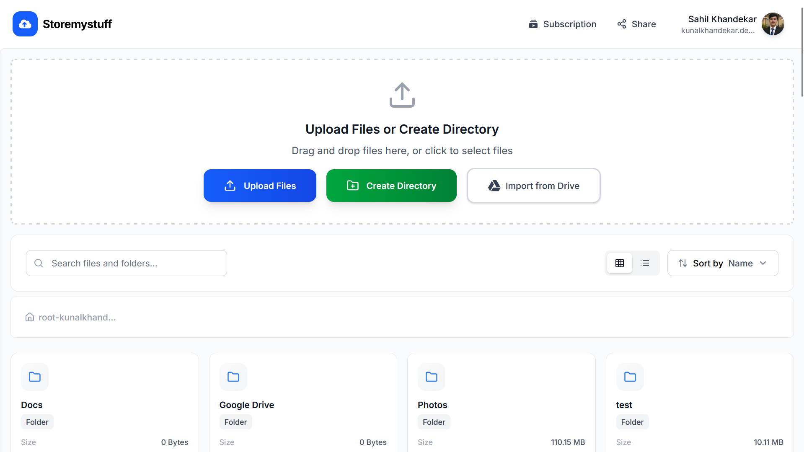
  
  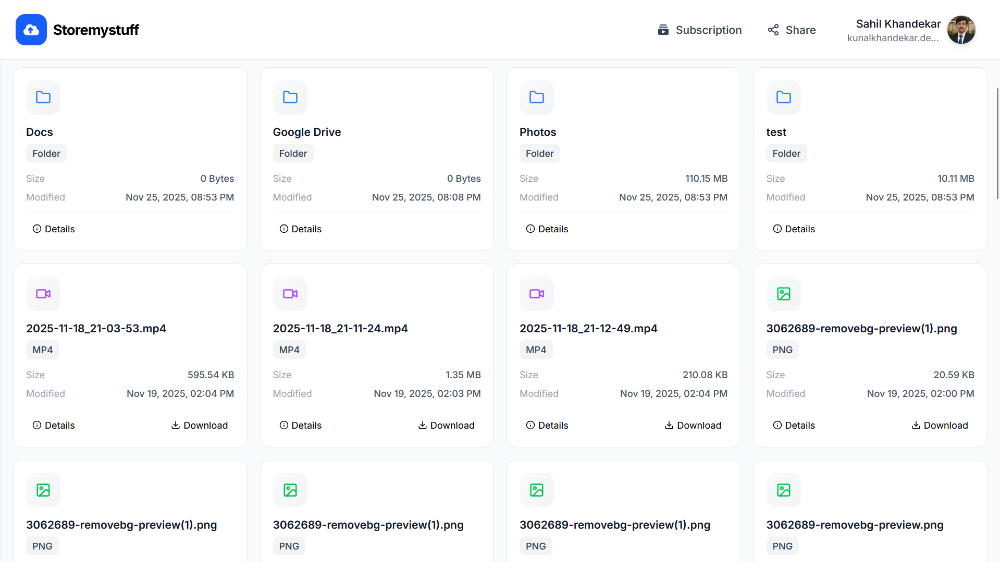
    
  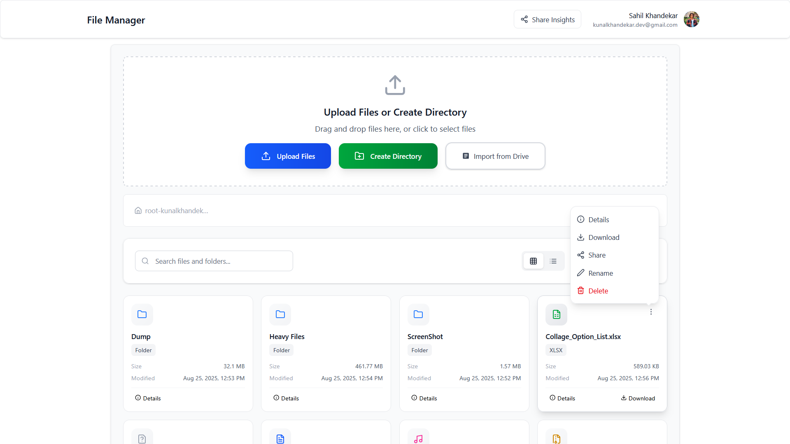
</p>

---

### ⚙️ Settings

<p align="center">
  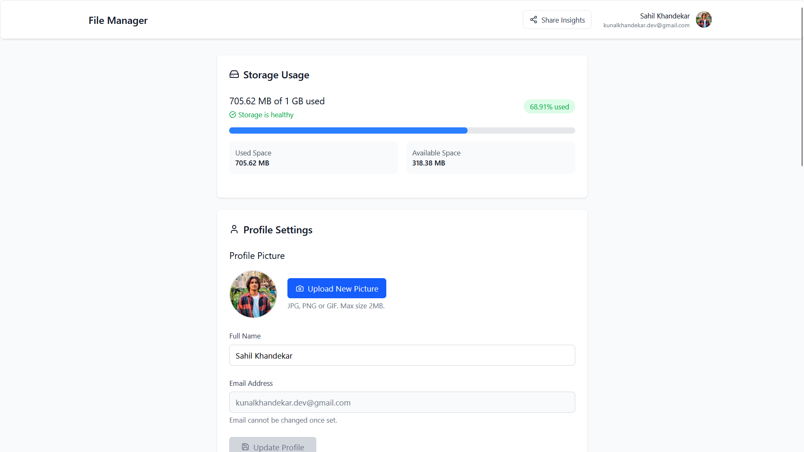
  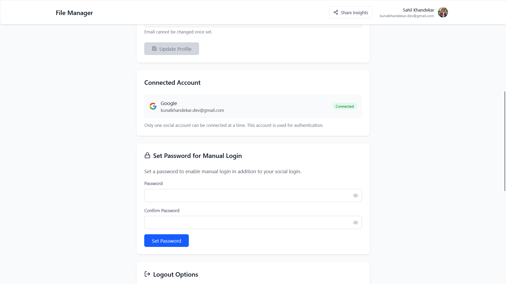
  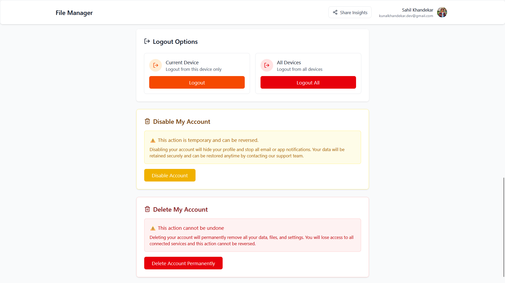
</p>

---

### 📤 Share

<p align="center">
  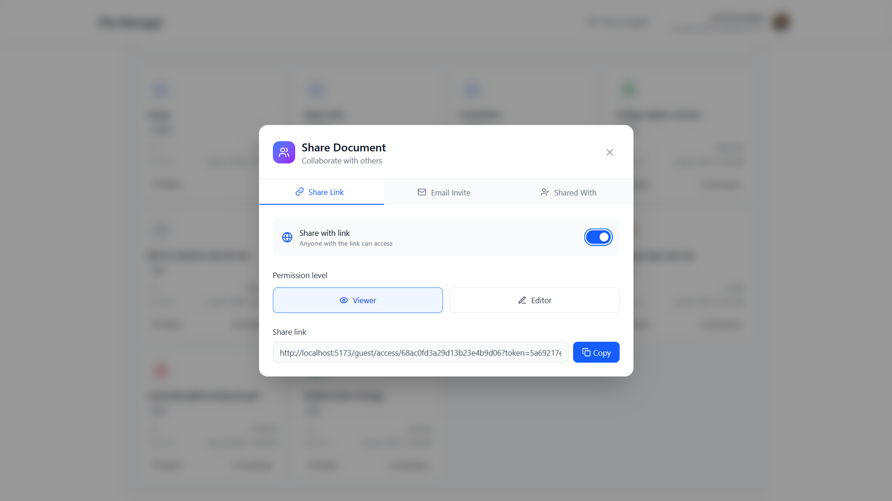
  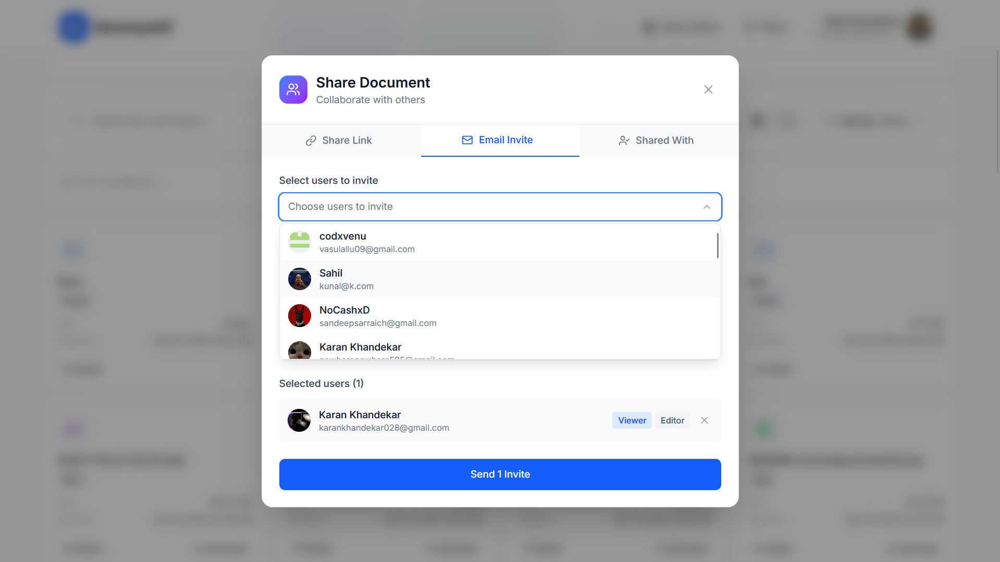
  
  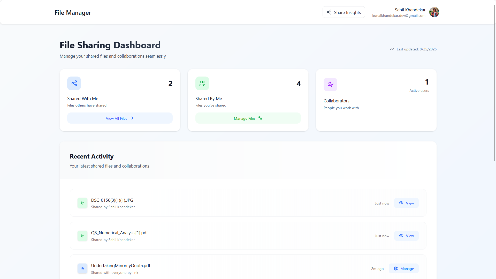
  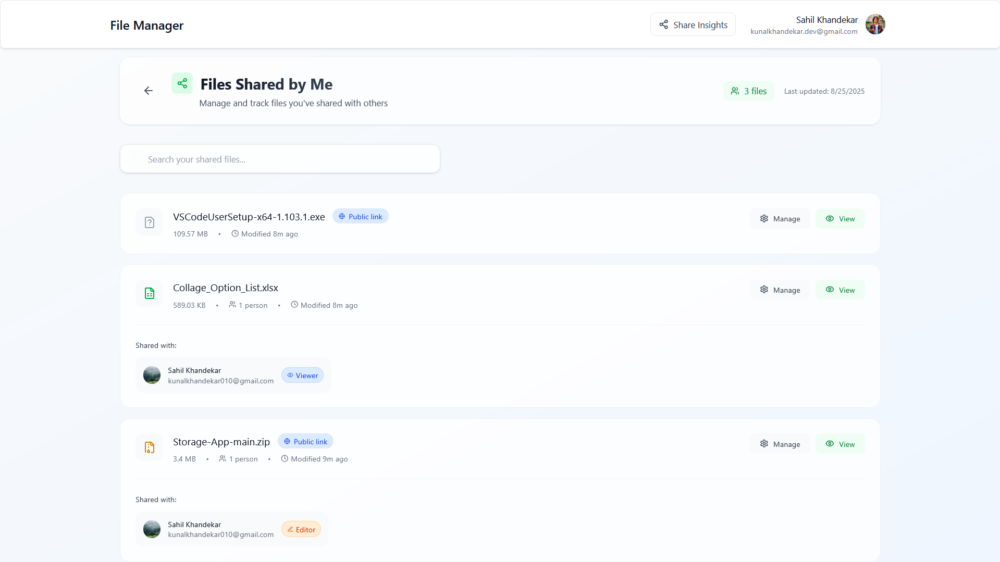
  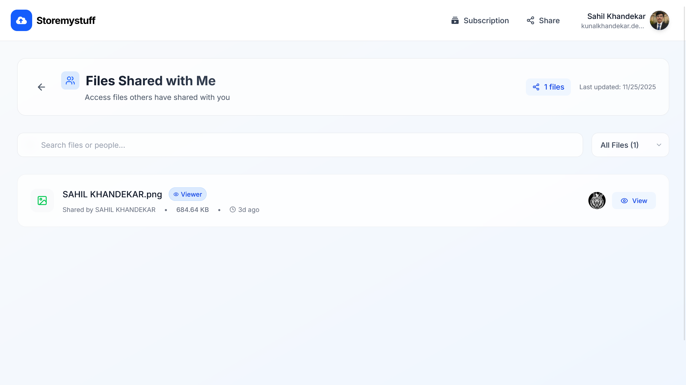
  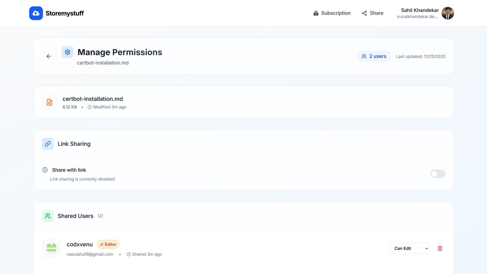
</p>

### 🛠️ Admin Dashboard

<p align="center">
  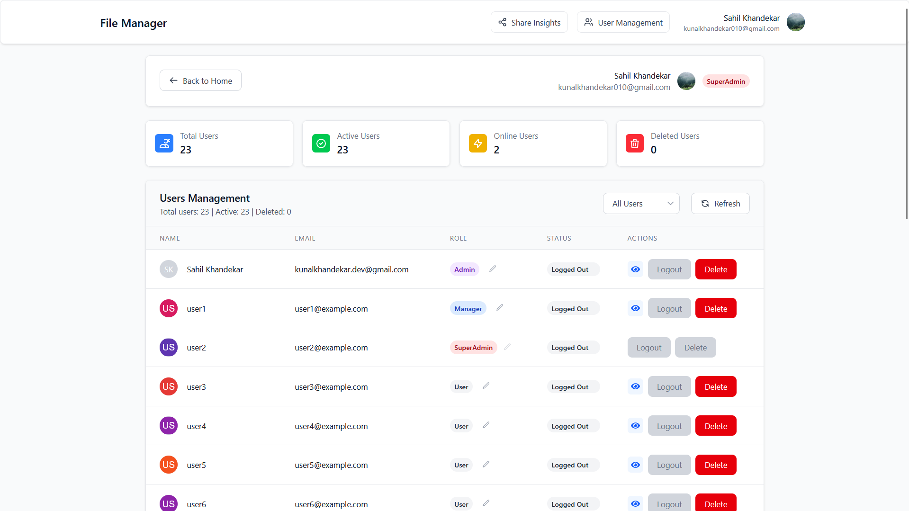
  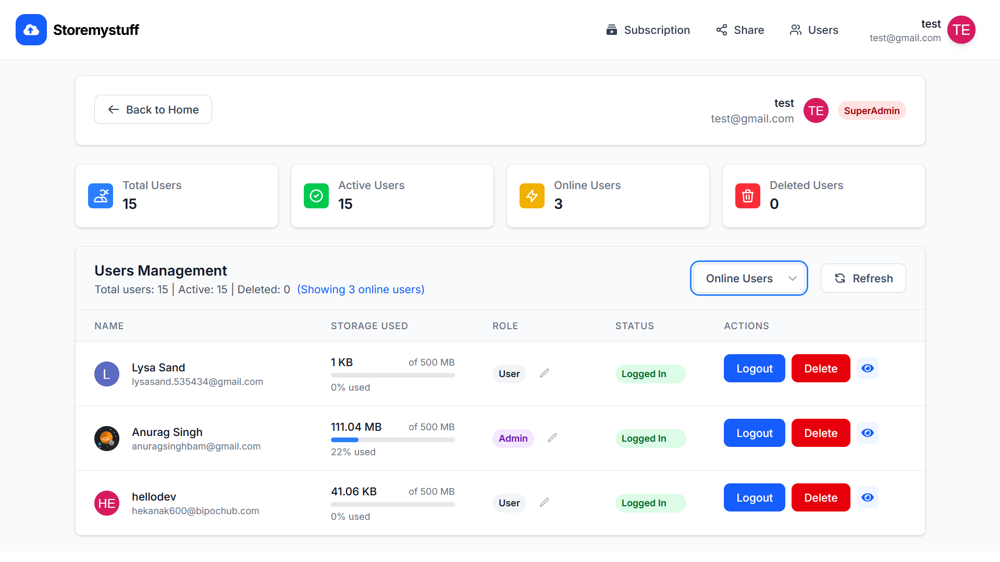
  
  
</p>

### Import from Drive
<p align="center">
  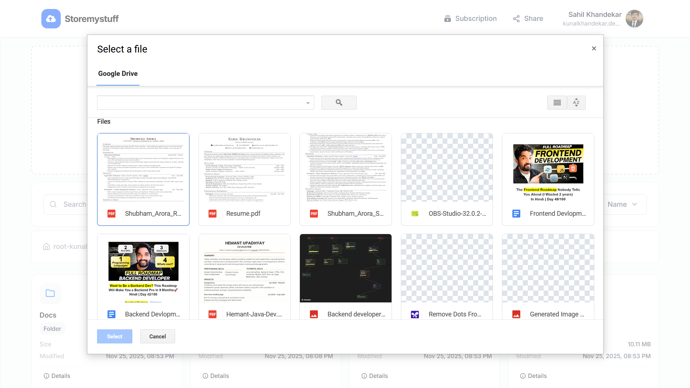
  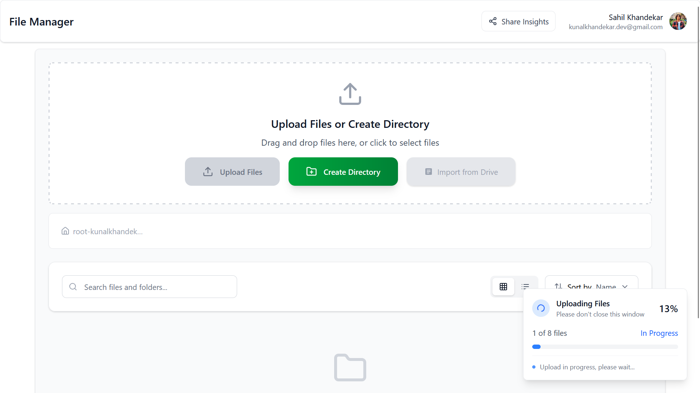
  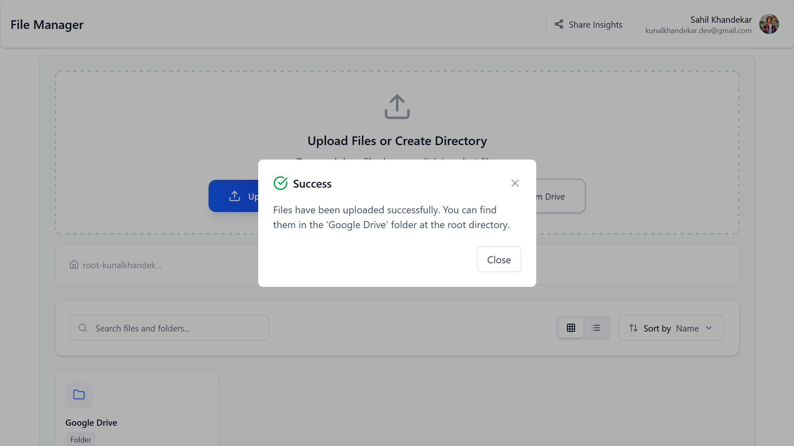
  </p>
  
---

## ⚡ Tech Stack

- **Frontend**: React, TailwindCSS, Vite
- **Backend**: Node.js, Express.js
- **Database**: MongoDB, Redis
- **Cloud Storage**: AWS S3, CloudFront CDN
- **External APIs**: Google Drive API, Google OAuth2
- **Authentication**: Bcrypt + OTP + OAuth (Google/GitHub)

---

## 🚀 Getting Started

### Clone Repository

```bash
git clone https://github.com/KunalKhandekar/Storage-App.git
cd Storage-App
```

## ⚙️ Environment Setup

### Client `.env`

```bash

# Backend & Frontend URLs
VITE_BACKEND_URL="http://localhost:4000"
VITE_BASE_URL="http://localhost:5173"

# Google Drive & OAuth
VITE_GOOGLE_CLIENT_ID="<your-google-oauth-client-id>"
VITE_GOOGLE_APP_ID="<your-google-app-id>"
```

### Server `.env`

```bash
# MongoDB
MONGODB_URL="mongodb://<user>:<password>@localhost:27017/StorageApp?replicaSet=rs0&authSource=admin"

# OAuth credentials
GOOGLE_CLIENT_ID="<your-google-oauth-client-id>"
GOOGLE_CLIENT_SECRET="<your-google-oauth-client-secret>"
GITHUB_CLIENT_ID="<your-github-oauth-client-id>"
GITHUB_CLIENT_SECRET="<your-github-oauth-client-secret>"

# Security & sessions
COOKIE_SECRET="<your-random-cookie-secret>"

# Server
PORT=4000
BASE_URL="http://localhost:4000"
CLIENT_URL="http://localhost:5173"

# Email (Resend)
RESEND_KEY="<your-resend-api-key>"

# AWS S3
AWS_PROFILE="<your-aws-profile>"
AWS_BUCKET="<your-s3-bucket-name>"

# CloudFront
CLOUDFRONT_URL="https://<your-cloudfront-domain>"
CLOUDFRONT_PROFILE_URL="https://<your-cloudfront-profile-domain>"
KEY_PAIR_ID="<your-cloudfront-key-pair-id>"
CLOUDFRONT_PRIVATE_KEY="<paste-your-cloudfront-private-key>"
```

## 🖥️ Client Setup

1. Navigate to the **Client** folder:
   ```bash
   cd Client
   ```
2. Install dependencies:
   ```bash
   npm install
   ```
3. Add your environment variables in `.env`.
4. Run the development server:
   ```bash
   npm run dev
   ```

### ⚙️ Server Setup

1. Navigate to the **Server** folder:
   ```bash
   cd Server
   ```
2. Install dependencies:
   ```bash
   npm install
   ```
3. Add your environment variables in `.env`.
4. **AWS Setup**: Configure your AWS credentials and ensure your S3 bucket and CloudFront distribution are properly set up.
5. **Google Drive API Setup**: Enable Google Drive API in Google Cloud Console and configure OAuth consent screen.
6. Run setup script (for database and required folders):
   ```bash
    npm run setup
   ```
7. Ensure Redis is running (via WSL or local setup).
8. Run the development server:
   ```bash
   npm run dev
   ```

---

## 🔧 Additional Setup Requirements

### AWS Configuration

1. **Create S3 Bucket**: Set up your S3 bucket with appropriate permissions for file storage.
2. **CloudFront Distribution**: Configure CloudFront for fast content delivery and signed URL generation.
3. **IAM Permissions**: Ensure your AWS profile has the necessary permissions for S3 operations.
4. **Private Key**: Generate and configure the CloudFront private key for signed URL generation.

### Google Drive API Setup

1. **Google Cloud Console**: Create a project and enable the Google Drive API.
2. **OAuth 2.0 Credentials**: Configure OAuth 2.0 client IDs for both web application and server-side access.
3. **Consent Screen**: Set up the OAuth consent screen with appropriate scopes for Drive access.
4. **API Key**: Generate an API key for Google Drive operations (if required).

### Key Features Enabled

- **Seamless Google Drive Import**: Users can browse and import files directly from their Google Drive.
- **Cloud Storage**: All files (uploaded and imported) are stored securely in AWS S3.
- **Fast Delivery**: CloudFront CDN ensures fast file access worldwide.
- **Scalable Architecture**: S3 storage eliminates local storage limitations.
- **Secure File Access**: Signed URLs ensure secure, time-limited file access.

---
