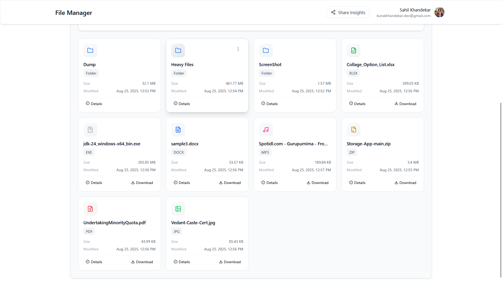
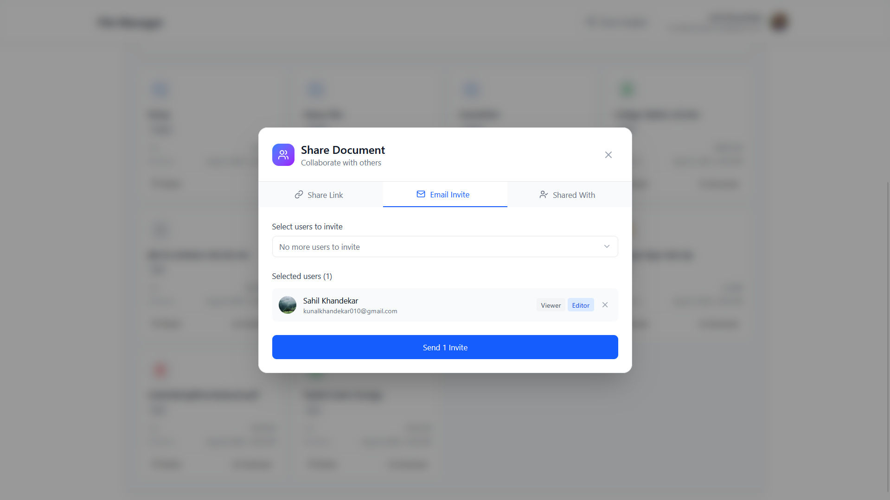
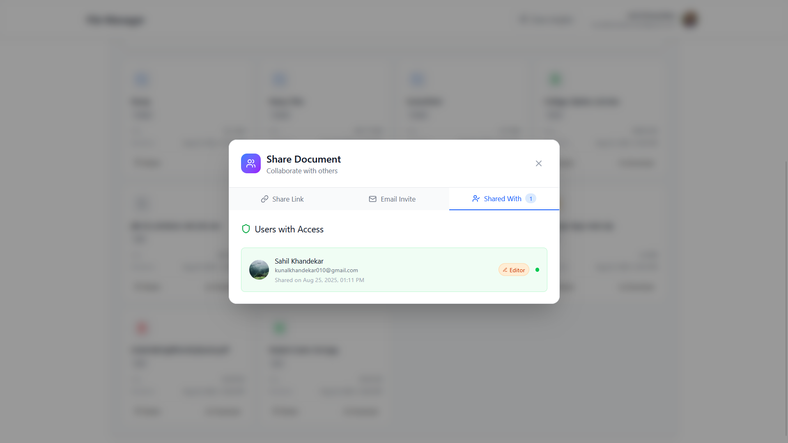
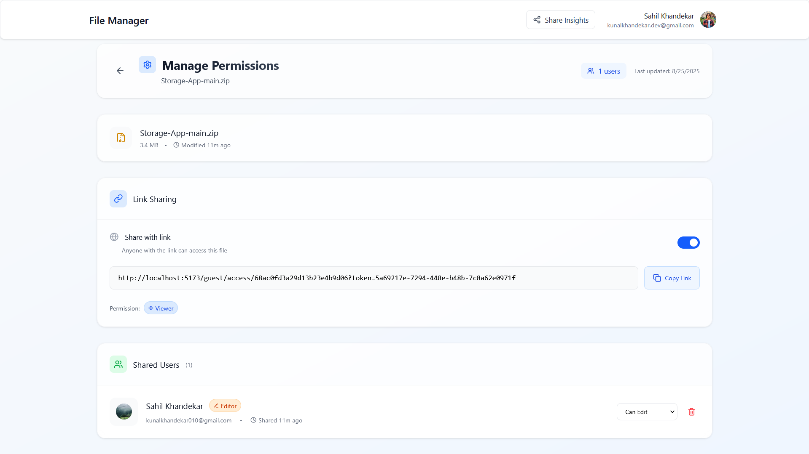

# 🚀 Storage App

A full-stack cloud storage application that allows users to upload, manage, and share their files securely.  
Built with **React + Vite + TailwindCSS (Client)** and **Node.js + Express + MongoDB + Redis (Server)**.

---

## 📚 Table of Contents

- [✨ Features](#-features)
  - [🔐 Authentication & Security](#-authentication--security)
  - [📂 File Management](#-file-management)
  - [🏷️ Sharing & Permissions](#️-sharing--permissions)
  - [⚙️ Settings & Customization](#️-settings--customization)
  - [🛠️ Admin Dashboard](#️-admin-dashboard)
- [🏗️ Project Structure](#️-project-structure)
  - [Client (Frontend - React + Vite + Tailwind)](#client-frontend---react--vite--tailwind)
  - [Server (Backend - Node + Express + MongoDB)](#server-backend---node--express--mongodb)
- [📸 Screenshot Overview](#-screenshot-overview)
  - [🔐 Login & Register](#-login--register)
  - [🏠 HomePage](#-homepage)
  - [⚙️ Settings](#️-settings)
  - [📤 Share](#-share)
- [⚡ Tech Stack](#-tech-stack)
- [🚀 Getting Started](#-getting-started)
  - [Clone Repository](#clone-repository)
- [⚙️ Environment Setup](#️-environment-setup)
  - [Client `.env`](#client-env)
  - [Server `.env`](#server-env)
- [🖥️ Client Setup](#️-client-setup)
- [⚙️ Server Setup](#️-server-setup)

---

## ✨ Features

### 🔐 Authentication & Security

- User registration and login with email + password.
- OAuth Login for **Google & GitHub**.
- OTP-based verification for secure account setup.
- Passwords stored in hashed format (bcrypt).
- Token stored in cookies (Signed Cookies).
- CORS, Helmet, and sanitization for enhanced security.
- Rate Limiting & Throttling.

### 📂 File Management

- Upload any file (PDF, Images, Videos, Docs, etc.) with progress tracking.
- Supports **Grid and List views** for file navigation.
- View file details (size, type, created date, modified date).
- Search & filter files easily.
- Rename, delete (soft & hard delete), and recover files.
- Storage usage tracking.

### 🏷️ Sharing & Permissions

- Share files via email **(Registered Users Only)**, or direct link **(Guest Users)**.
- Role-based sharing (Viewer / Editor ).
- Dashboard to manage **"Shared by Me"** and **"Shared with Me"** files.
- View recent activity logs (shares).
- Real-time permission updates.

### ⚙️ Settings & Customization

- Update profile info (name, email, profile picture).
- Statistic of used/available Storage.
- Change password.
- Manage connected devices/sessions.
- Account Options **(Logout/Disable/Delete)**.

### 🛠️ Admin Dashboard

- User Overview – Track total, active, online, and deleted users.
- User Management – View, filter, edit roles, force logout, and delete users.
- Deletion System – Soft Delete (recoverable) & Hard Delete (permanent) with confirmation.
- Role & Permissions – Roles like User, Manager, Admin, SuperAdmin with badges.
- File Management – Access directories/files with navigation.
- Real-Time Tracking – Monitor online users and refresh instantly.

## 🏗️ Project Structure

### Client (Frontend - React + Vite + Tailwind)

```bash
├── Client
    ├── .gitignore                # Git ignore rules for client
    ├── eslint.config.js          # ESLint configuration for code linting
    ├── index.html                # Root HTML file for Vite
    ├── package-lock.json         # Auto-generated dependency lock file
    ├── package.json              # Project dependencies & scripts
    ├── src                       # Source code directory
    │   ├── Apis                  # API service layer (Axios wrappers)
    │   │   ├── adminApi.js
    │   │   ├── authApi.js
    │   │   ├── axios.js
    │   │   ├── file_Dir_Api.js
    │   │   ├── shareApi.js
    │   │   ├── uploadApi.js
    │   │   └── userApi.js
    │   ├── App.jsx               # Root React component
    │   ├── Contexts              # Global React contexts (state management)
    │   │   ├── AuthContent.jsx
    │   │   ├── ModalContainer.jsx
    │   │   ├── ModalContext.jsx
    │   │   └── StorageContext.jsx
    │   ├── Pages                 # Main application pages
    │   │   ├── AdminUserView     # Admin page for viewing a single user
    │   │   │   ├── Breadcrumb.jsx
    │   │   │   ├── ItemCard.jsx
    │   │   │   └── index.jsx
    │   │   ├── AdminViewPage     # Admin dashboard with role/user management
    │   │   │   ├── DeleteModal.jsx
    │   │   │   ├── EmptyState.jsx
    │   │   │   ├── ErrorDisplay.jsx
    │   │   │   ├── LoadingSpinner.jsx
    │   │   │   ├── RoleBadge.jsx
    │   │   │   ├── RoleChangeDropdown.jsx
    │   │   │   ├── Sections      # Sub-sections inside AdminView
    │   │   │   │   ├── Statistics.jsx
    │   │   │   │   └── UserTable.jsx
    │   │   │   ├── StatusBadge.jsx
    │   │   │   ├── UserActions.jsx
    │   │   │   ├── UserProfile.jsx
    │   │   │   ├── UserTableRow.jsx
    │   │   │   └── index.jsx
    │   │   ├── DirectoryPage     # Core file/directory browser
    │   │   │   ├── Breadcrumb.jsx
    │   │   │   ├── CreateModal.jsx
    │   │   │   ├── DirectoryView.jsx
    │   │   │   ├── Dropdown.jsx
    │   │   │   ├── ItemCard.jsx
    │   │   │   ├── RenameModal.jsx
    │   │   │   ├── ToolBar.jsx
    │   │   │   ├── UploadSection.jsx
    │   │   │   ├── index.jsx
    │   │   │   └── view          # Directory view types
    │   │   │       ├── GridView.jsx
    │   │   │       └── ListView.jsx
    │   │   ├── SettingsPage      # User settings & preferences
    │   │   │   ├── AccountOptions.jsx
    │   │   │   ├── ConnectedAccount.jsx
    │   │   │   ├── LogoutOptions.jsx
    │   │   │   ├── PasswordSettings.jsx
    │   │   │   ├── ProfileSettings.jsx
    │   │   │   ├── StorageUsage.jsx
    │   │   │   └── index.jsx
    │   │   └── SharePage         # Sharing-related views
    │   │       ├── Dashboard     # Share dashboard
    │   │       │   ├── Header.jsx
    │   │       │   ├── QuickActions.jsx
    │   │       │   ├── RecentActivity.jsx
    │   │       │   ├── Stats.jsx
    │   │       │   └── index.jsx
    │   │       ├── FileViewer.jsx
    │   │       ├── PermissionManager  # Manage file sharing permissions
    │   │       │   ├── FileInfo.jsx
    │   │       │   ├── Header.jsx
    │   │       │   ├── LinkSharingCard.jsx
    │   │       │   ├── SharedUsers.jsx
    │   │       │   └── index.jsx
    │   │       ├── SharedByMe    # Files user shared with others
    │   │       │   ├── FileList.jsx
    │   │       │   ├── Header.jsx
    │   │       │   ├── SearchBar.jsx
    │   │       │   └── index.jsx
    │   │       └── SharedWithMe  # Files shared with the user
    │   │           ├── FileList.jsx
    │   │           ├── Header.jsx
    │   │           ├── SearchAndFilter.jsx
    │   │           └── index.jsx
    │   ├── Utils                 # Helper functions
    │   │   ├── getUserPermissions.js
    │   │   └── helpers.jsx
    │   ├── components            # Reusable UI components
    │   │   ├── AdminHeader.jsx
    │   │   ├── AuthError.jsx
    │   │   ├── AuthLoader.jsx
    │   │   ├── Forms             # Authentication forms
    │   │   │   ├── CredentialsForm.jsx
    │   │   │   ├── LoginCredentialForm.jsx
    │   │   │   ├── LoginForm.jsx
    │   │   │   ├── OTPForm.jsx
    │   │   │   └── RegisterForm.jsx
    │   │   ├── GuestFileAccess.jsx
    │   │   ├── Header.jsx
    │   │   ├── ImportDrive.jsx   # Import from external storage (Google Drive etc.)
    │   │   ├── Layout.jsx        # App layout wrapper
    │   │   ├── Modals            # App-wide modal components
    │   │   │   ├── ConfrimationModal.jsx
    │   │   │   ├── FileDetailsModal.jsx
    │   │   │   ├── FilePreviewModal.jsx
    │   │   │   ├── Modal.jsx
    │   │   │   ├── ProgressModal.jsx
    │   │   │   └── ShareModal.jsx
    │   │   ├── NotFound.jsx      # 404 page
    │   │   ├── ProtectedRoute.jsx # Guarded routes for authenticated users
    │   │   ├── PublicOnlyRoute.jsx # Routes only accessible by guests
    │   │   ├── RenderFile.jsx
    │   │   ├── ShimmerUI         # Loading placeholders
    │   │   │   ├── DirectoryShimmer.jsx
    │   │   │   ├── PermissionManagerShimmer.jsx
    │   │   │   ├── ShareDashboardShimmer.jsx
    │   │   │   ├── SharedByMeShimmer.jsx
    │   │   │   └── SharedWithMeShimmer.jsx
    │   │   ├── SocialAuthButtons.jsx # Google/GitHub login buttons
    │   │   └── StepProgress.jsx
    │   ├── css
    │   │   └── main.css          # Global styles
    │   ├── hooks                 # Custom React hooks
    │   │   ├── useAdminUserView.js
    │   │   ├── useDirectory.js
    │   │   ├── usePermissionManager.js
    │   │   ├── useShareModal.js
    │   │   ├── useUserSettings.js
    │   │   └── useUsers.js
    │   ├── main.jsx              # App entry point
    │   └── routes                # Routing system
    │       ├── GuestRoutes.jsx
    │       ├── ProtectedRoutes.jsx
    │       ├── PublicRoutes.jsx
    │       └── index.jsx
    └── vite.config.js            # Vite configuration file
```

### Server (Backend - Node + Express + MongoDB)

```bash
├── Server
    ├── app.js                        # Entry point for the server (initializes Express app, middleware, and routes)
    ├── config
    │   ├── db.js                     # Database connection setup (MongoDB)
    │   ├── redis.js                  # Redis client setup for caching and sessions
    │   └── setup.js                  # Centralized app configuration (env, server setup, etc.)
    ├── controllers                   # Handle request/response logic for each resource
    │   ├── authControllers.js        # Login, register, OAuth, and session handling
    │   ├── dirControllers.js         # Directory CRUD (create, list, delete, move)
    │   ├── fileControllers.js        # File upload, download, delete, metadata handling
    │   ├── otpControllers.js         # OTP generation & validation
    │   └── userControllers.js        # User profile management & settings
    ├── middlewares                   # Reusable middleware functions
    │   ├── auth.js                   # Session authentication middleware
    │   ├── checkAction.js            # Validate allowed user actions (login/register)
    │   ├── checkFIleShared.js        # Check if a file is shared with the current user
    │   ├── checkFileAccess.js        # Permission check before accessing a file
    │   ├── checkRole.js              # Role-based access control (admin, user, .etc)
    │   ├── errorHandler.js           # Global error handling middleware
    │   ├── serveFile.js              # Middleware for streaming/serving files
    │   └── validateRequest.js        # Request validation against mongoose Object Id.
    ├── models                        # Database schemas/models
    │   ├── dirModel.js               # Directory schema
    │   ├── fileModel.js              # File schema )
    │   ├── otpModel.js               # OTP schema
    │   └── userModel.js              # User schema
    ├── package-lock.json             # Auto-generated dependency lock file
    ├── package.json                  # Server dependencies and scripts
    ├── routes                        # Express route definitions
    │   ├── authRoutes.js             # Routes for login, register, logout, etc.
    │   ├── dirRoutes.js              # Routes for directory operations
    │   ├── fileRoutes.js             # Routes for file operations
    │   ├── guestRoutes.js            # Public/guest access routes
    │   ├── otpRoutes.js              # Routes for OTP handling
    │   └── userRoutes.js             # Routes for user profile/settings
    ├── seeds
    │   └── userSeed.js               # Script for seeding default users/admins
    ├── services                      # Core business logic (decoupled from controllers)
    │   ├── Directory
    │   │   ├── collectDirectoryContents.js  # Collect all files/subdirectories in a folder
    │   │   └── index.js                      # Export directory service functions
    │   ├── auth
    │   │   ├── checkSessionLimit.js          # Enforce max active sessions per user
    │   │   ├── createRedisSession.js         # Create a Redis session for user login
    │   │   ├── createUserWithRootDir.js      # Create user and assign root directory
    │   │   ├── deleteOldRedisSession.js      # Remove expired/old sessions from Redis
    │   │   ├── findAndValidateOAuthUser.js   # Check OAuth user validity
    │   │   ├── githubAuthService.js          # GitHub OAuth logic
    │   │   ├── googleService.js              # Google OAuth logic
    │   │   ├── handleExistingUser.js         # Handle login for already registered users
    │   │   ├── index.js                      # Export authentication services
    │   │   ├── isValidCredentials.js         # Validate email/password credentials
    │   │   ├── isValidOTP.js                 # Validate OTP code
    │   │   ├── parseTempToken.js             # Parse temporary token (for recreation of session)
    │   │   ├── registerNewOAuthUser.js       # Register a user via OAuth
    │   │   └── userExists.js                 # Check if a user already exists
    │   ├── file
    │   │   ├── index.js                      # Export file services
    │   │   ├── sharedByMeFiles.js            # Files shared by the logged-in user
    │   │   └── sharedWithMeFiles.js          # Files shared with the logged-in user
    │   ├── index.js                          # Entry point exporting all services
    │   ├── otpService.js                     # OTP creation, validation, cleanup
    │   └── user
    │       └── index.js                      # User services (profile updates, etc.)
    ├── utils                         # Utility/helper functions
    │   ├── Constants.js              # Centralized constants
    │   ├── ErrorResponse.js          # Custom error response class
    │   ├── MulterSetup.js            # Multer setup for file uploads
    │   ├── RateLimiter.js            # Middleware/service for rate-limiting
    │   ├── SuccessResponse.js        # Custom success response format
    │   ├── Throttler.js              # Throttling implementation
    │   ├── ValidateInputs.js         # Generic input validation utilities
    │   ├── canPerform.js             # Check if user can perform a specific action
    │   ├── generatePath.js           # Generate file/folder paths
    │   ├── sanitizeInput.js          # Sanitize user input for security
    │   └── setCookie.js              # Utility for setting secure cookies
    └── validators                    # Schema-based input validation
        ├── authSchema.js             # Validation schema for auth routes
        ├── commonValidation.js       # Reusable/common validation rules
        └── fileSchema.js             # Validation schema for file operations
```

---

## 📸 Screenshot Overview

### 🔐 Login & Register

<p align="center">
  
  
  
</p>

---

### 🏠 HomePage

<p align="center">
  
  
  
    
  
</p>

---

### ⚙️ Settings

<p align="center">
  
  
  
</p>

---

### 📤 Share

<p align="center">
  
  
  
  
  
  
  
</p>

### 🛠️ Admin Dashboard
<p align="center">
  
  
  
  
</p>

---

## ⚡ Tech Stack

- **Frontend**: React, TailwindCSS  
- **Backend**: Node.js, Express.js  
- **Database**: MongoDB, Redis.
- **Authentication**: Bcrypt + OTP
- **Storage**: Local/Multer , **(Future) Cloud (AWS S3)**

---

## 🚀 Getting Started

### Clone Repository

```bash
git clone https://github.com/KunalKhandekar/Storage-App.git
cd Storage-App
```

## ⚙️ Environment Setup

### Client ```.env```
  ```bash
  VITE_GOOGLE_CLIENT_ID=<your-google-client-id>
  ```

### Server ```.env```
  ```bash
  # MongoDB
  MONGODB_URL="mongodb://<username>:<password>@localhost:27017/StorageApp?replicaSet=rs0&authSource=admin"

  # OAuth Credentials
  GOOGLE_CLIENT_ID=<your-google-client-id>
  GOOGLE_CLIENT_SECRET=<your-google-client-secret>
  GITHUB_CLIENT_ID=<your-github-client-id>
  GITHUB_CLIENT_SECRET=<your-github-client-secret>

  # Signed Secret
  COOKIE_SECRET="<your-cookie-secret>"

  # Port
  PORT=4000

  # Email (Resend API Key)
  RESEND_KEY=<your-resend-api-key>

  # Base URLs
  BASE_URL=http://localhost:4000
  CLIENT_URL=http://localhost:5173
  ```

## 🖥️ Client Setup

1. Navigate to the **Client** folder:
    ```bash
    cd Client
    ````
2. Install dependencies:
    ```bash
    npm install
    ```
3. Add your environment variables in ```.env```.
4. Run the development server:
    ```bash
    npm run dev
    ```

### ⚙️ Server Setup 

1. Navigate to the **Server** folder:
    ```bash
    cd Server
    ````
2. Install dependencies:
    ```bash
    npm install
    ```
3. Add your environment variables in ```.env```.
4. Run setup script (for database and required folders):
   ```bash
    npm run setup
    ```
5. Ensure Redis is running (via WSL or local setup).
6. Run the development server:
    ```bash
    npm run dev
    ```

---