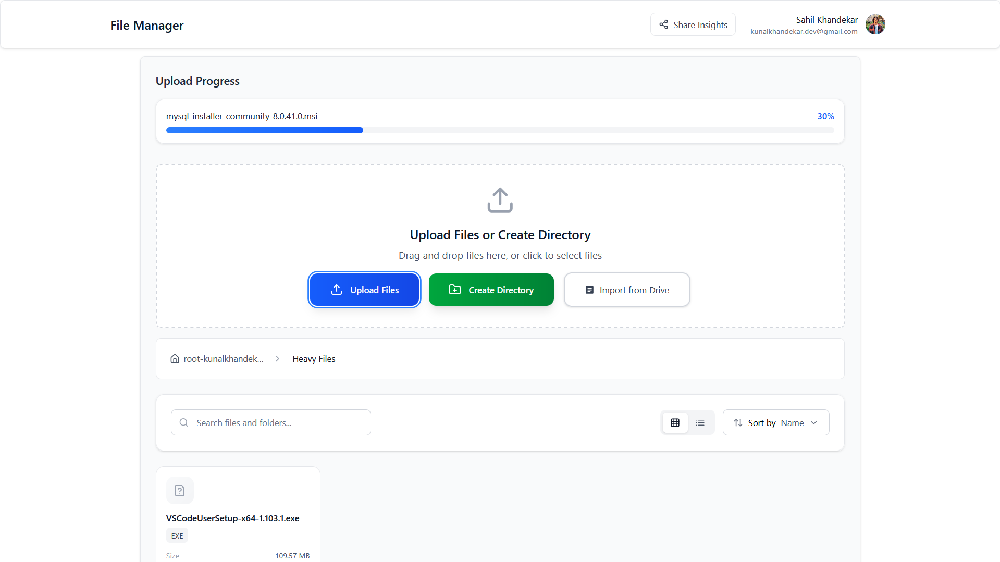
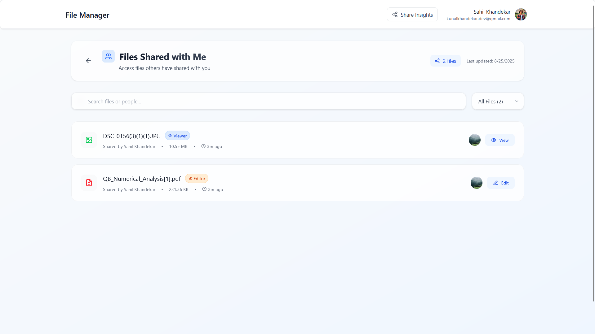
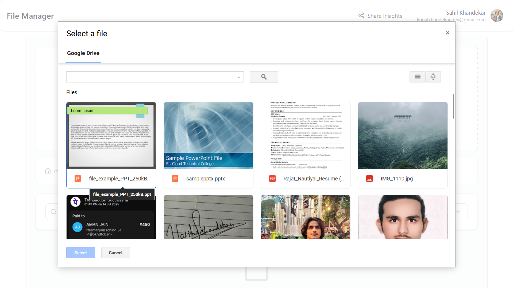

# Storemystuff.cloud

A full-stack **cloud storage application** that allows users to upload, manage, and share their files securely.  
It includes a **subscription based storage system** powered by **Razorpay**, enabling users to upgrade their storage plans smoothly.

The **client** is built with **React**, **Vite**, and **TailwindCSS**, while the **server** uses **Node.js**, **Express**, **MongoDB**, and **Redis**.  
The application stores files using **AWS S3** and also supports **Google Drive Import** for seamless file transfers.


---

## Table of Contents

- [Features](#features)
  - [Authentication and Security](#authentication-and-security)
  - [File Management](#file-management)
  - [Cloud Storage and Import](#cloud-storage-and-import)
  - [Sharing and Permissions](#sharing-and-permissions)
  - [Settings and Customization](#settings-and-customization)
  - [Admin Dashboard](#admin-dashboard)
  - [Subscriptions and Billing](#subscriptions-and-billing)
- [Project Structure](#project-structure)
  - [Client (Frontend - React + Vite + Tailwind)](#client-frontend---react--vite--tailwind)
  - [Server (Backend - Node + Express + MongoDB)](#server-backend---node--express--mongodb)
- [Screenshot Overview](#screenshot-overview)
  - [Login and Register](#login-and-register)
  - [HomePage](#homepage)
  - [Settings](#settings)
  - [Share](#share)
- [Tech Stack](#tech-stack)
- [Getting Started](#getting-started)
  - [Clone Repository](#clone-repository)
- [Environment Setup](#environment-setup)
  - [Client `.env`](#client-env)
  - [Server `.env`](#server-env)
- [Client Setup](#client-setup)
- [Server Setup](#server-setup)

---

## Features

### Authentication and Security

- User registration and login with email and password.
- OAuth Login for **Google and GitHub**.
- OTP-based verification for secure account setup.
- Passwords stored in hashed format (bcrypt).
- Token stored in cookies (Signed Cookies).
- CORS, Helmet, and sanitization for enhanced security.
- Rate Limiting and Throttling.

### File Management

- Upload any file (PDF, Images, Videos, Docs, etc.) with progress tracking.
- **Cloud storage with AWS S3** for scalable and reliable file storage.
- Supports **Grid and List views** for file navigation.
- View file details (size, type, created date, modified date).
- Search and filter files easily.
- Rename, delete (soft and hard delete), and recover files.
- Storage usage tracking with cloud-based quota management.

### Cloud Storage and Import

- **AWS S3 Integration** for secure cloud file storage.
- **CloudFront CDN** for fast file delivery and optimized performance.
- **Google Drive Import** - seamlessly import files from Google Drive to your storage.
- Batch import functionality for multiple files.
- Progress tracking for import operations.
- Automatic file type detection and metadata preservation.

### Sharing and Permissions

- Share files via email **(Registered Users Only)**, or direct link **(Guest Users)**.
- Role-based sharing (Viewer / Editor).
- Dashboard to manage **"Shared by Me"** and **"Shared with Me"** files.
- View recent activity logs (shares).
- Real-time permission updates.

### Settings and Customization

- Update profile info (name, email, profile picture).
- Statistic of used/available Storage.
- Change password.
- Manage connected devices/sessions.
- Account Options **(Logout/Disable/Delete)**.

### Admin Dashboard

- User Overview - Track total, active, online, and deleted users.
- User Management - View, filter, edit roles, force logout, and delete users.
- Deletion System - Soft Delete (recoverable) and Hard Delete (permanent) with confirmation.
- Role and Permissions - Roles like User, Manager, Admin, SuperAdmin with badges.
- File Management - Access directories/files with navigation.
- Real-Time Tracking - Monitor online users and refresh instantly.

### Subscriptions and Billing

- Subscription plans with monthly and yearly options.
- Secure payment processing using Razorpay Checkout.
- Automatic activation of purchased plans with usage limits updated instantly.
- Webhook based payment verification for reliable status tracking.
- Auto renewal support for recurring subscriptions.
- Manage active plan, upgrade or downgrade, and cancel subscription inside the dashboard.
- Billing history with invoice links.
- Access control based on plan limits such as storage quota, file upload size, and advanced features.

## Project Structure

### Client (Frontend - React + Vite + Tailwind)
```bash
Client/
├── .gitignore
├── eslint.config.js
├── index.html
├── package-lock.json
├── package.json
├── vite.config.js
└── src/
    ├── App.jsx                  # Root component
    ├── main.jsx                 # Entry point
    ├── Apis/                    # API request handlers
    │   ├── adminApi.js
    │   ├── authApi.js
    │   ├── axios.js             # Axios instance setup
    │   ├── file_Dir_Api.js
    │   ├── shareApi.js
    │   ├── uploadApi.js
    │   └── userApi.js
    ├── Contexts/                # Global contexts
    │   ├── AuthContext.jsx      # Authentication state
    │   ├── ModalContainer.jsx
    │   ├── ModalContext.jsx     # Modal state management
    │   ├── ProgressContext.jsx  # Upload progress state
    │   └── StorageContext.jsx   # Storage and directory state
    ├── Pages/                   # Application pages
    │   ├── AdminUserView/
    │   ├── AdminViewPage/
    │   ├── DirectoryPage/
    │   ├── SettingsPage/
    │   ├── SubscriptionPage/
    │   └── SharePage/
    ├── Utils/                   # Helper utilities
    ├── components/              # Reusable UI components
    │   ├── Forms/
    │   ├── Modals/
    │   └── ShimmerUI/           # Skeleton loaders
    ├── css/
    │   └── main.css             # Global styles
    ├── hooks/                   # Custom React hooks
    └── routes/                  # Route protection and layouts
        ├── GuestRoutes.jsx
        ├── ProtectedRoutes.jsx
        ├── PublicRoutes.jsx
        └── index.jsx
```

### Server (Backend - Node + Express + MongoDB + AWS)

```bash
Server/
├── app.js                       # Main server file
├── package-lock.json
├── package.json
├── config/                      # Configurations
│   ├── db.js                    # MongoDB connection
│   ├── redis.js                 # Redis client setup
│   └── setup.js                 # Initial setup like environment config
├── controllers/                 # Route controllers
├── middlewares/                 # Middlewares like auth, error handling
├── models/                      # MongoDB schemas
│   ├── dirModel.js
│   ├── fileModel.js
│   ├── otpModel.js
│   └── userModel.js 
├── routes/                      # API routes
│   ├── authRoutes.js
│   ├── dirRoutes.js
│   ├── fileRoutes.js
│   ├── guestRoutes.js
│   ├── otpRoutes.js
│   └── userRoutes.js
├── services/                    # Business logic
│   ├── index.js
│   ├── otpService.js
│   ├── Directory/               # Directory related operations
│   ├── auth/                    # Auth related logic
│   ├── file/                    # File handling logic
│   ├── subscription/            # Subscription handling logic
│   └── user/                    # User specific logic
├── utils/                       # Helper utilities
└── validators/                  # Input validation logic
```


## Screenshot Overview

### Login and Register

<p align="center">
  
  
  
</p>

---

### HomePage

<p align="center">
  
  
  
  
  
</p>

---

### Settings

<p align="center">
  
  
  
  
</p>

---

### Share

<p align="center">
  
  
  
  
  
  
  
</p>

### Admin Dashboard

<p align="center">
  
  
  
  
</p>

### Import from Drive

<p align="center">
  
  
  
</p>

### Subscriptions (Razorpay)

<p align="center">
  
  
  
  
  
</p>

---

## Tech Stack

- **Frontend**: React, TailwindCSS, Vite
- **Backend**: Node.js, Express.js
- **Database**: MongoDB, Redis
- **Cloud Storage**: AWS S3, CloudFront CDN
- **External APIs**: Google Drive API, Google OAuth2
- **Authentication**: Bcrypt + OTP + OAuth (Google/GitHub)
- **Payment**: Razorpay Subscriptions + Webhooks

---

## Getting Started

### Clone Repository

```bash
git clone https://github.com/KunalKhandekar/Storage-App.git
cd Storage-App
```

## Environment Setup

### Client `.env`

```bash
VITE_GOOGLE_CLIENT_ID=
VITE_GOOGLE_API_KEY=
VITE_GOOGLE_APP_ID=
VITE_BACKEND_URL=
```

### Server `.env`

```bash
PORT=4000
CLIENT_URLS="http://localhost:5173,https://www.storemystuff.cloud,https://storemystuff.cloud,https://app.storemystuff.cloud"
DEFAULT_CLIENT_URL="http://localhost:5173"
NODE_ENV="development"
BASE_URL="http://localhost:4000"

# Database
MONGODB_URL=""
REDIS_URI=""

# OAuth Credentials
GOOGLE_CLIENT_ID=""
GOOGLE_CLIENT_SECRET=""
GITHUB_CLIENT_ID=""
GITHUB_CLIENT_SECRET=""

# Signed Secret
COOKIE_SECRET=""

# Resend API Key
RESEND_KEY=""

# AWS Configuration
AWS_ACCESS_KEY=""
AWS_SECRET_ACCESS_KEY=""
AWS_BUCKET=""
AWS_REGION="ap-south-1"

# CloudFront Configuration
CLOUDFRONT_URL=""
CLOUDFRONT_PROFILE_URL=""

# Key Pair ID
KEY_PAIR_ID=""

# Private Key
CLOUDFRONT_PRIVATE_KEY=""

# Razorpay Live Credentials
RAZORPAY_LIVE_KEY_ID=""
RAZORPAY_LIVE_KEY_SECRET=""

# Razorpay Test Credentials
RAZORPAY_TEST_KEY_ID=""
RAZORPAY_TEST_KEY_SECRET=""

RAZORPAY_WEBHOOK_SECRET=""
RAZORPAY_INVOICE_LINK=""

PAYMENT_ENV="test"
```

## Client Setup

1. Navigate to the **Client** folder:

   ```bash
   cd Client
   ```

2. Install dependencies:

   ```bash
   npm install
   ```

3. Add your environment variables in `.env`.

4. Run the development server:

   ```bash
   npm run dev
   ```

## Server Setup

1. Navigate to the **Server** folder:

   ```bash
   cd Server
   ```

2. Install dependencies:

   ```bash
   npm install
   ```

3. Add your environment variables in `.env`.

4. **AWS Setup**: Configure your AWS credentials and ensure your S3 bucket and CloudFront distribution are properly set up.

5. **Google Drive API Setup**: Enable Google Drive API in Google Cloud Console and configure OAuth consent screen.

6. Run setup script (for database and required folders):

   ```bash
   npm run setup
   ```

7. Ensure Redis is running (via WSL or local setup).

8. Run the development server:

   ```bash
   npm run dev
   ```

---

## Additional Setup Requirements

### AWS Configuration

1. **Create S3 Bucket**: Set up your S3 bucket with appropriate permissions for file storage.
2. **CloudFront Distribution**: Configure CloudFront for fast content delivery and signed URL generation.
3. **IAM Permissions**: Ensure your AWS profile has the necessary permissions for S3 operations.
4. **Private Key**: Generate and configure the CloudFront private key for signed URL generation.

### Google Drive API Setup

1. **Google Cloud Console**: Create a project and enable the Google Drive API.
2. **OAuth 2.0 Credentials**: Configure OAuth 2.0 client IDs for both web application and server-side access.
3. **Consent Screen**: Set up the OAuth consent screen with appropriate scopes for Drive access.
4. **API Key**: Generate an API key for Google Drive operations (if required)

### Razorpay API KEYS 
