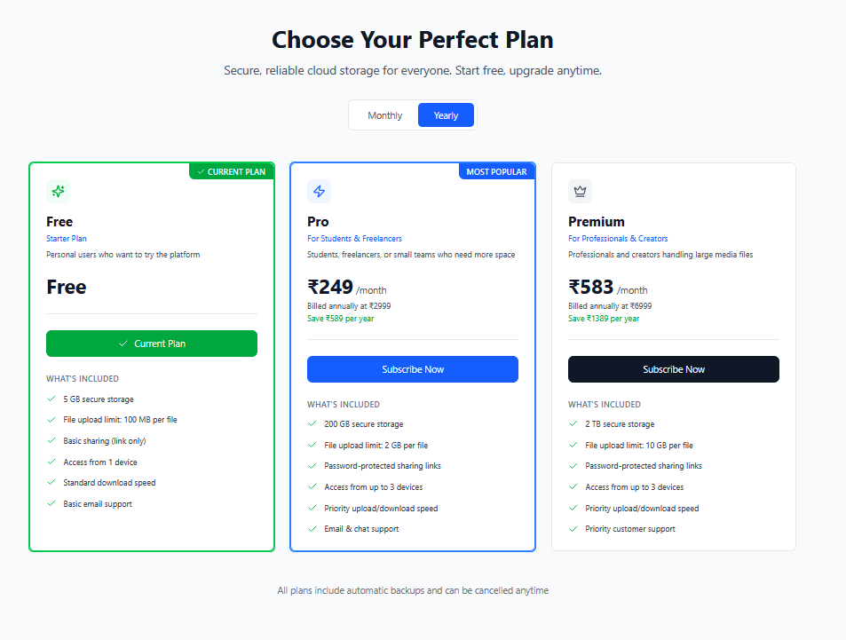
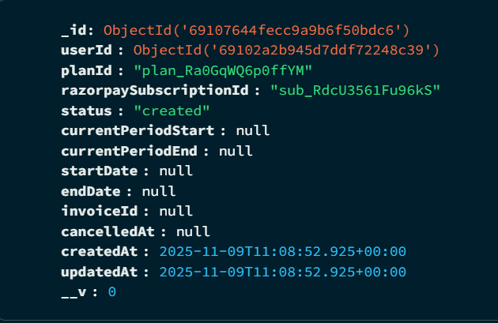
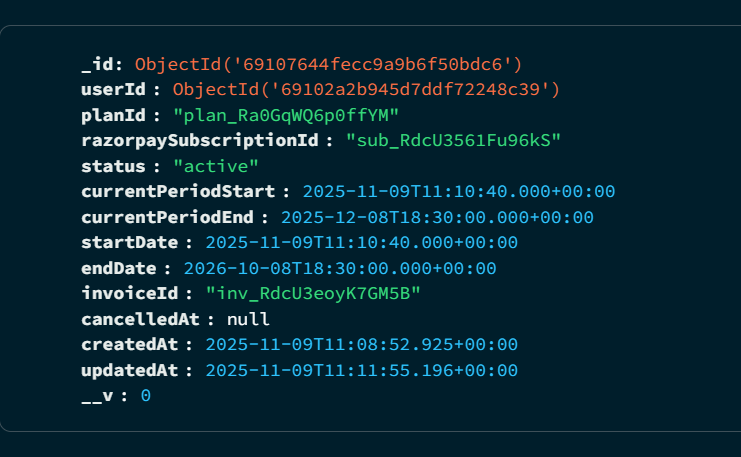
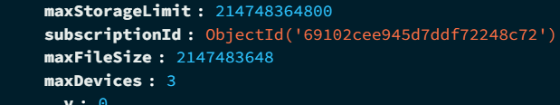
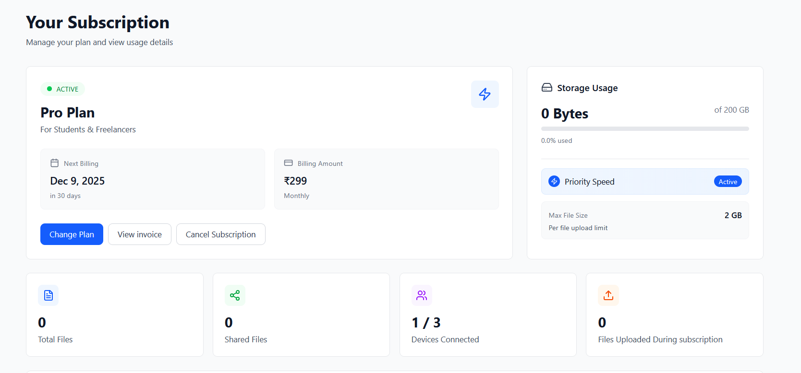
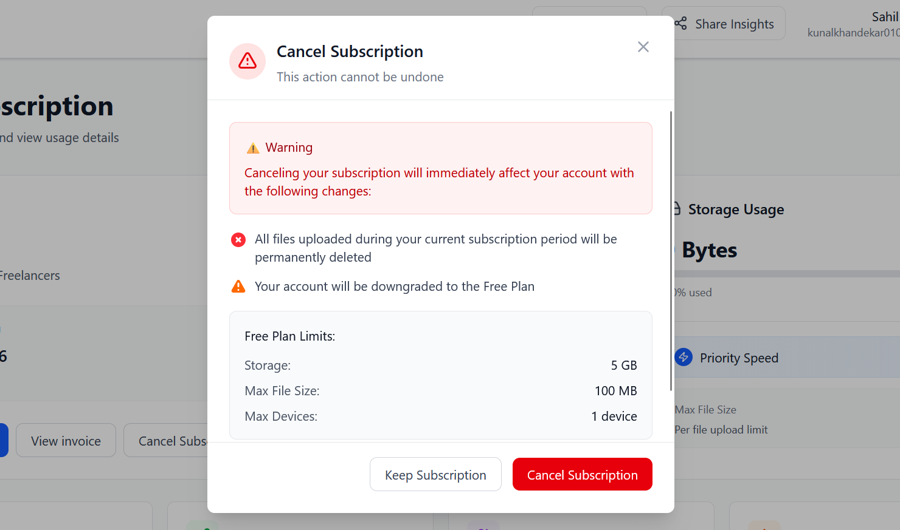
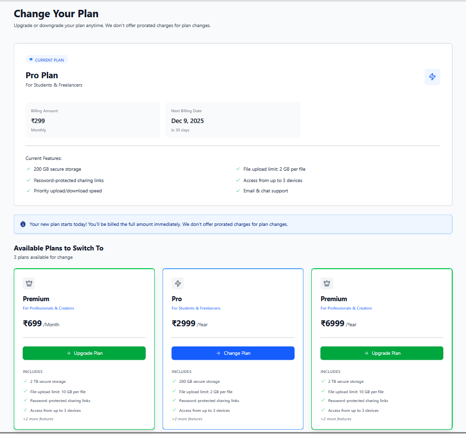
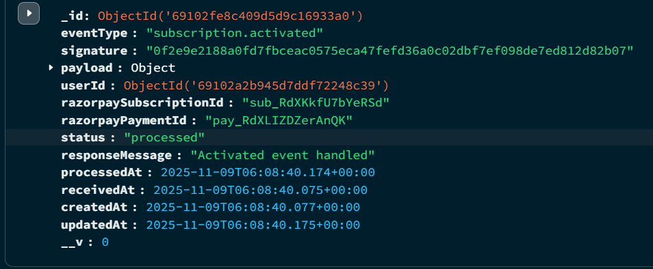

# Subscription System Documentation

## Overview
This document explains how the subscription system works, from creation to cancellation.

---

## Creating a Subscription



**Key Rule:** Each user can only have ONE subscription document at a time.

### Three Scenarios:

**1. First-time subscriber**
- Create a new subscription
- Return the subscription ID

**2. User resubscribing to the same plan**
- Check if there's an existing subscription with:
  - Same plan ID
  - Status = "created"
- If found, return that subscription ID (no new subscription created)

**3. User switching to a different plan**
- Cancel the old subscription (if status = "created")
- Create a new subscription with the new plan
- Return the new subscription ID



---

## Payment & Activation Process

### What happens after the user pays?

Razorpay sends multiple webhook events:
1. `subscription.authenticated` - Payment authorized by bank
2. `subscription.charged` - First payment collected
3. `subscription.activated` - Subscription is now active

**We only use the `subscription.activated` event**

When this event fires:
- Update the subscription in the database


- Grant premium features to the user


---

## Subscription Status API

Shows different screens based on the user's subscription state:

### Case 1: No Active Subscription
- Display available plans
- User can choose and purchase a plan

### Case 2: Renewal Failed
- Show warning message
- Prompt user to retry payment


### Case 3: Active Subscription
- Display plan details
- Show current usage stats
- Show validity/expiry date

---

## Cancelling a Subscription

**No grace period is given.**



When a user cancels:
1. Premium access is immediately revoked
2. All uploaded files are deleted
3. User is downgraded to free tier

### How it works:

**If user has an active subscription:**
1. Call Razorpay's cancel API
2. Update status to "cancelled" in database
3. Wait for `subscription.cancelled` webhook to complete the process

### The `subscription.cancelled` webhook handles two cases:

**Case 1: Plan switch (not a real cancellation)**
- If subscription status = "created", ignore this webhook
- This happens when user changes plans (see Creation Flow #3)

**Case 2: Actual cancellation**
- Revoke premium access (storage, device limits, etc.)
- Delete all files uploaded during subscription
- Remove subscription from database

---

## Changing Plans



### API 1: `plansEligibleForChange`

**What it does:**
- Checks if user has an active plan
- Returns current plan details
- Returns list of other available plans

**Logic:**
```javascript
availablePlans = allPlans.filter(plan => plan.id !== currentPlan.id)
```

### API 2: `changePlan`

Takes the new plan ID and determines if this is:
- **Upgrade** - Moving to a higher tier
- **Downgrade** - Moving to a lower tier  
- **Cycle change** - Switching billing period (monthly ↔ yearly)

---

### Upgrade or Cycle Change:

1. Create new subscription with status = "pending"
2. Return subscription ID to frontend
3. User completes payment
4. `subscription.activated` webhook fires
5. Check if status = "pending"
6. Delete old subscription
7. Activate new subscription
8. Update user benefits

### Downgrade:

1. Check if current storage usage exceeds new plan limit
2. If yes → Show error: "Please delete some data before downgrading"
3. If eligible:
   - Create new subscription with status = "pending"
   - Follow same flow as upgrade

---

## Recurring Payments

### Successful Payment (`subscription.charged`)

When automatic renewal succeeds:
- Update `currentPeriod` in database
- Update `latestInvoiceId`

### Failed Payment (`subscription.pending`)

When automatic renewal fails (e.g., insufficient funds):

**What we do:**
- Mark subscription as "renewal_failed" in database
- Show warning message on UI

**What Razorpay does:**
- Automatically retries payment 3 times (Day 1, Day 2, Day 3)
- If all retries fail → Status changes to "halted"
- Subscription is cancelled

**When cancellation happens:**
- Webhook triggers
- We revoke user access
- Delete all data from database

## Storing webhook request in Database



---

## Summary

This subscription system handles:
- ✅ Creating subscriptions (first-time, repeat, plan changes)
- ✅ Activating subscriptions after payment
- ✅ Displaying subscription status
- ✅ Cancelling subscriptions
- ✅ Changing plans (upgrade/downgrade/cycle)
- ✅ Automatic renewals (success and failure cases)

All critical operations are handled through Razorpay webhooks to ensure data consistency and security.